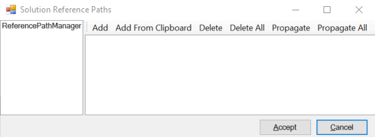

Manage Reference Paths
==========

A Visual Studio extension for managing the reference paths from all the projects from a centralized place. 

Download from the [VS Gallery](https://visualstudiogallery.msdn.microsoft.com/f2f5c60c-2cff-4882-a036-8a818f4c65af).

Sometimes it is convenient to build a solution with a specific version of a dependency, for example with a debug compilation of it to trace a bug that crosses application boundaries. The project setting `Reference Paths fits the bill nicely but, being a project level setting, it is tedious to configure for solutions with many projects.

This extension centralizes this configuration and allows you to add and remove paths for all (or some) of the projects in one fell swoop.

##How it works

This extension add to the `Tools` menu a new item named `Manage reference paths`. Selecting it open this dialog:

On the left panel all the projects from the current solution are listed. When one or more of them are selected on the right panel their currently defined reference paths are displayed.
Paths present in all selected projects are shown in black, when missing from some they are shown in gray.
The available actions are:
- `Add`: opens a directory dialog. The path selected will be added to all selected projects.
- `Add From Clipboard`: retrieves the path from system's Clipboard. The path will be added to all selected projects. The same action can be triggered by using "Ctrl + V" keyboard shortcut.
- `Delete`: removes the selected paths from the currently selected projects.
- `Delete All`:  removes the selected paths from all projects in the solution.
- `Propagate`:  ensures that the selected paths are present in the currently selected projects.
- `Propagate All`:  ensures that the selected paths are present in all projects from the solution.

Paths can also be added from the clipboard with Ctrl+V.